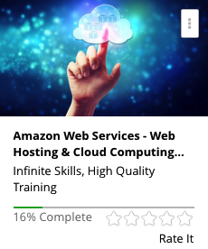

```
Roberto Nogueira  
BSd EE, MSd CE
Solution Integrator Experienced - Certified by Ericsson
```
# Udemy Amazon Web Services



**About **

Learn everything you need to about the subject of this `Udemy` project.

[Homepage](https://www.udemy.com/amazon-web-services-for-web-hosting-cloud-computing/)

## Topics
```
Section: 1
5 / 5
Introduction To Amazon Web Services
[ ] 1. Important - Working Files - Download These First
[ ] 2. 0101 Amazon Web Services - What Is The Cloud? 10:17
[ ] 3. 0102 Scalability And Costs In The Cloud 5:52
[ ] 4. 0103 Cloud Impacts On Architecture 4:50
[ ] 5. 0104 Creating A Cloud Account With AWS 3:06

Section: 2
3 / 6
Amazon Web Services Overview
[ ] 6. 0201 AWS Value Propositions 3:36
[ ] 7. 0202 Regions And Availability Zones 3:33
[ ] 8. 0203 AWS - Introduction To Service Families 7:26
[ ] 9. 0204 Roll Your Own Vs. AWS-Supplied Services 3:38
[ ] 10. 0205 Interfaces: Web GUI, APIs, And SDK 7:40
[ ] 11. 0206 Introduction To Authentication And Authorization 6:55

Section: 3
0 / 8
EC2 Virtual Servers
[ ] 12. 0301 Instance Types, Security Groups, Keypairs, And User Data 10:26
[ ] 13. 0302 EC2 Disk Options: EBS Vs. Ephemeral 6:57
[ ] 14. 0303 Spinning Up Your First EC2 Server And SSHing In 9:57
[ ] 15. 0304 EC2 Gotchas: Keypairs, DNS Changes, Etc. 4:11
[ ] 16. 0305 Amazon Web Services Templatizing Servers With AMIs 3:21
[ ] 17. 0306 EBS: Snapshots, Attaching, And Detaching 13:17
[ ] 18. 0307 Pricing Model For EC2 7:53
[ ] 19. 0308 Making An AMI 5:07

Section: 4
0 / 2
Elastic Load Balancers
[ ] 20. 0401 AWS - Elastic Load Balancers: Introduction 5:05
[ ] 21. 0402 Elastic Load Balancers: Lab 10:15

Section: 5
0 / 1
AutoScaling And CloudWatch
[ ] 22. 0501 Using AutoScaling and CloudWatch 13:17

Section: 6
0 / 1
CloudFormation
[ ] 23. 0601 Setting Up A CloudFormation 7:50

Section: 7
0 / 1
Storage In AWS
[ ] 24. 0701 Available Storage Types: S3, RDS, And Dynamo 8:41

Section: 8
0 / 1
Relational Database Service
[ ] 25. 0801 AWS - Provisioning An RDS 3:31

Section: 9
0 / 4
Simple Storage Service
[ ] 26. 0901 Introduction To S3 7:27
[ ] 27. 0902 Advanced Features Of S3 6:37
[ ] 28. 0903 S3 Hands On 5:41
[ ] 29. 0904 AWS - S3 Cmd Tool Setup And Usage 5:53

Section: 10
0 / 1
CloudFront
[ ] 30. 1001 A Quick Tour of CloudFront 5:06

Section: 11
0 / 1
ElastiCache
[ ] 31. 1101 Provisioning An ElastiCache Instance 3:31

Section: 12
0 / 2
Virtual Private Cloud
[ ] 32. 1201 AWS - Introduction To VPC 10:01
[ ] 33. 1202 Advanced VPC: Networking, Stacks, Etc. 3:24

Section: 13
0 / 2
Simple Notification Service
[ ] 34. 1301 Introduction To SNS 3:58
[ ] 35. 1302 Use Cases And Best Practices 2:27

Section: 14
0 / 1
Simple Email Service
[ ] 36. 1401 SES - An In-Depth Look 5:48

Section: 15
0 / 3
Simple Queuing Service
[ ] 37. 1501 AWS - Overview Of Queues 4:19
[ ] 38. 1502 Introduction To SQS 5:19
[ ] 39. 1503 SQS Use Cases 2:52

Section: 16
0 / 3
Identity And Access Management (IAM)
[ ] 40. 1601 Introduction To IAM 9:58
[ ] 41. 1602 AWS - IAM Advanced Topics 4:03
[ ] 42. 1603 IAM Hands On 6:39

Section: 17
0 / 1
Route 53
[ ] 43. 1701 A Close Look At Route 53 3:22

Section: 18
0 / 7
Building A 3 Tier Scalable Web Application In The Cloud
[ ] 44. 1801 Application Overview 2:40
[ ] 45. 1802 Download And Modify CloudFormation Template - Part 1 2:56
[ ] 46. 1803 Download And Modify CloudFormation Template - Part 2 3:34
[ ] 47. 1804 Download And Modify CloudFormation Template - Part 3 2:09
[ ] 48. 1805 AWS - Build Stack With CloudFormation 11:11
[ ] 49. 1806 Review Stack In Web GUI 5:22
[ ] 50. 1807 Simulating Load On The Application 14:41

Section: 19
0 / 1
Conclusion
[ ] 51. 1901 AWS Wrap Up 1:18
```
